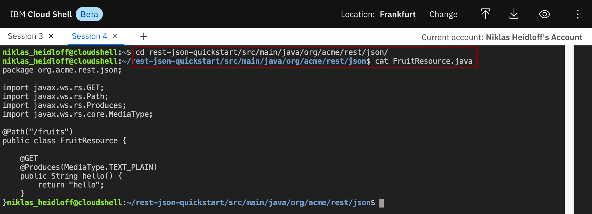

Navigator:
* [Workshop Description](https://nheidloff.github.io/workshop-quarkus-openshift-reactive-endpoints/)
* Lab 1: [Create your Cloud Environment](lab1.md)
* Lab 2: [Deploy Kafka via Script](lab2.md)
* Lab 3: [Deploy Postgres via Operator](lab3.md)
* Lab 4: [Deploy Sample Application](lab4.md)
* Lab 5: Develop reactive Endpoints
* Lab 6: [Invoke Endpoints reactively](lab6.md)
* Lab 7: [Deploy Service to OpenShift](lab7.md)
* Lab 8 (optional): [Use distributed Logging](lab8.md)

---

# Lab 5: Develop reactive Endpoints

In this lab you will learn how to develop reactive endpoints with standard Java functionality via [CompletionStage](https://docs.oracle.com/javase/8/docs/api/java/util/concurrent/CompletionStage.html) and [CompletableFuture](https://docs.oracle.com/javase/8/docs/api/java/util/concurrent/CompletableFuture.html).

### Step 1: Create Quarkus Project

Let's start by creating a new Quarkus project with a synchronous REST endpoint. Invoke the following command the Cloud Shell.

```
$ mvn io.quarkus:quarkus-maven-plugin:1.4.1.Final:create \
    -DprojectGroupId=org.acme \
    -DprojectArtifactId=rest-json-quickstart \
    -DclassName="org.acme.rest.json.FruitResource" \
    -Dpath="/fruits" \
    -Dextensions="resteasy-jsonb"
```

To better understand which files have been created, run the same command locally and explore the generated code via the editor of your choice.

### Step 2: Test the synchronous Endpoint

In order to test the synchronous endpoint which has been created with the command above, run these commands in one terminal in the Cloud Shell.

```
$ cd rest-json-quickstart
$ ./mvnw compile quarkus:dev
```

Open a second terminal in the Cloud Shell and invoke the following command.

```
$ curl http://localhost:8080/fruits
```

You should see the following response.


The implementation of the synchronous endpoint is in the class [FruitResource.java](https://github.com/nheidloff/workshop-quarkus-openshift-reactive-endpoints/blob/master/finish/rest-json-quickstart/src/main/java/org/acme/rest/json/FruitResource.java). The annotations @Path, @Get and @Produces are used to define the endpoint via [JAX-RS](https://en.wikipedia.org/wiki/Java_API_for_RESTful_Web_Services).

```
$ cd rest-json-quickstart/src/main/java/org/acme/rest/json/
$ cat FruitResource.java 
```



### Step 3: ....

---

__Continue with [Lab 6: Invoke Endpoints reactively](lab6.md)__
